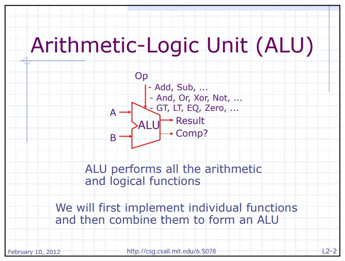
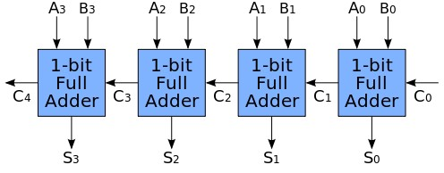
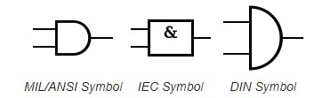
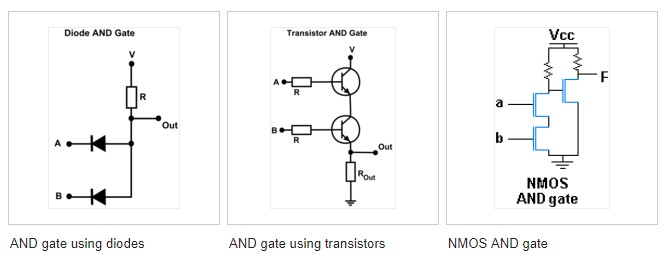
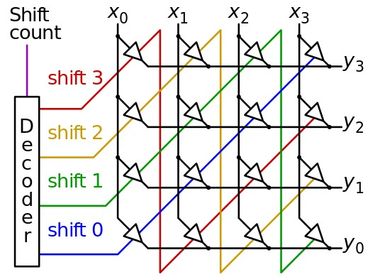
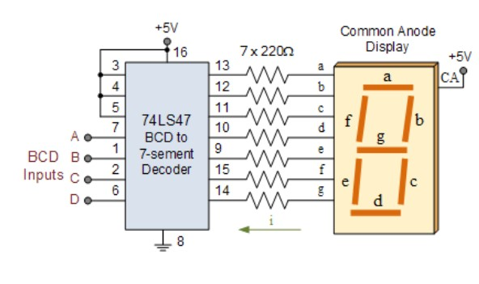
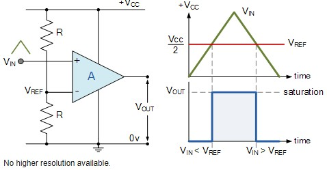

# vhdl_practices
<h1> todo list </h1>
<ul>
    <li>ALU.vhd</li>
    <ul>
        <li></li>
    </ul>
    <li>
        adder-4-bits.vhd 
        
    </li>
    <li>
        andGates-4.vhd 
        
        
    </li>
    <li>
        barrel_shifter.vhd 
        
    </li>
    <li>
        bcd_7seg.vhd 
        
    </li>
    <li>
        comparator-n.vhd 
        
    </li>
    <li>
        complex-integrated-circuits.vhd
    </li>
    <li>
        counter-8-bits.vhd
    </li>
    <li>
        d-flip-flop.vhd</li>
    <li>
        decoder-2-4.vhd</li>
    <li>
        demultiplexers-1-4.vhd</li>
    <li>
        encoder-4-2.vhd</li>
    <li>
        gNOT-4-bit.vhd</li>
    <li>
        gNOT.vhd first</li>
    <li>
        gOR.vhd</li>
    <li>
        integrated-circuits-4-inputs.vhd</li>
    <li>
        multiplexers-2-1.vhd</li>
    <li>
        multiplexers-4-1.vhd</li>
    <li>
        parallel-in-serial-out-8-bits.vhd</li>
    <li>
        parity-coding-gen-for.vhd</li>
    <li>
        parity-coding.vhd</li>
    <li>
        register-8-bits.vhd</li>
    <li>
        serial-in-parallel-out-8-bits.vhd</li>
    <li>
        shif-left-register-8-bits.vhd</li>
    <li>
        simultaneous-expressions.vhd</li>
    <h2>Kaynakça</h2>
    http://csg.csail.mit.edu/6.S078/6_S078_2012_www/handouts/lectures/L02-ComplexCombinationalCkts.pdf 
    http://www.wikizero.biz/index.php?q=aHR0cHM6Ly9lbi53aWtpcGVkaWEub3JnL3dpa2kvQWRkZXJfKGVsZWN0cm9uaWNzKQ 
    https://ieeexplore.ieee.org 
    Kitaplar:
    Donanım Tanımlama Dili VHDL ve FPGA Uygulamaları(Yazar: Ibrahim Savran)
</ul>
